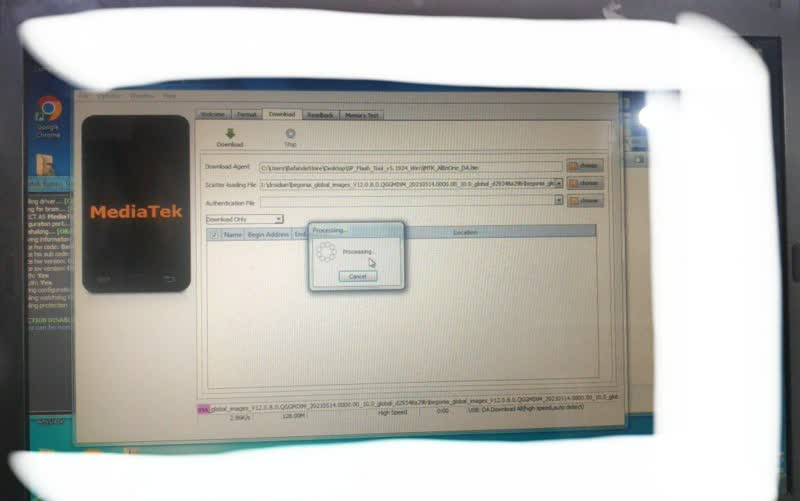

+++
title = "و بازهم نوت هشت پرو ترکید....."
description = "از دست این مدیاتک"
date=2024-03-04
category = "مدیاتک"
tags = ["مدیاتک"]

[extra]
author="سهراب بهدانی"
+++

 ترکیدن نوت هشت پرو دیگه برای من چیز عجیبی نیست، یعنی دفعه اولش که سر نصب اوبونتو تاچ منهدم شد و سافت بریک شد استرس بالایی داشتم ولی الان ها که این اتفاقا میفته دیگه ترسی ازش ندارم.

 ## چی میشه که میترکه؟

 خب به اصطلاح من به این نوت هشت پرو سیخ زیاد می‌زنم ، از نصب کاستوم رام گرفته تا نصب توزیع های لینوکسی با لیب‌هیبریس. همین الان هم که ترکید بخاطر نصب درویدیان بود 🥲

 بگذریم، وقتی که شما یک رام یا یک فریمور رو فلش می‌کنید و گوشی خوشش نمیاد ازش وارد مرحله ای میشه که بهش میگن سافت بریک، توی سافت بریک علایم حیاتی ندارید ولی قابل حل شدنه.

 ## چطور حل میشه و به چیا نیاز داریم؟

 اول از همه به یک سیستم ویندوزی که یک ویندوز ۶۴ بیتی روش نصب شده نیاز داریم و درایور های مدیاتک.

 همینطور به یک برنامه usbfilter نیاز داریم.
 و برنامه spflashtool و رام اصلی گوشی.
و یک bypassauth برای مدیاتک.

 **نکته**

 بعد از نصب رام توسط spflashtool امکان پاک شدن imei به دلیل مدیاتکی بودن بالاست، حتما یک بکاپ داشته باشید.

## حالا چیکار کنیم؟

درایور های مدیاتک رو نصب کنید، برنامه usbfilter رو اجرا کنید و دکمه vol up و vol down رو باهم بگیرید و گوشی رو با کابل به سیستم وصل کنید. گوشی حتما باید خاموش باشه.
بعد از اینکه صدای شناخته شدنش رو از ویندوز شنیدید توی usbfilter درایور مدیاتک رو پیدا کنید و روی filter بزنید.

برنامه bypassauth رو باز کنید، بعد از اینکه bypass رو دیدید روش بزنید و spflashtool رو اجرا کنید.

در تب download گزینه download رو روی format + download بزارید و بعد فایل scatter رام اصلی رو که توی پوشه اش هست بهش بدید و روی download بزنید.

این عملیات یک ربع زمان می بره و بعدش گوشی شما از سافت بریک درمیاد و قابل استفاده است.

**توجه**

بعد از فلش کردن با spflashtool بوت لودر بسته میشه.

## لینک های دانلود

[spflashtool](https://spflashtools.com)
[bypass + usbfilter](https://www.mobilerdx.com/2021/02/mediatek-bypass-tool-by-mct-team.html)
[mediatek usb drivers](https://androidmtk.com/download-mtk-usb-all-drivers)