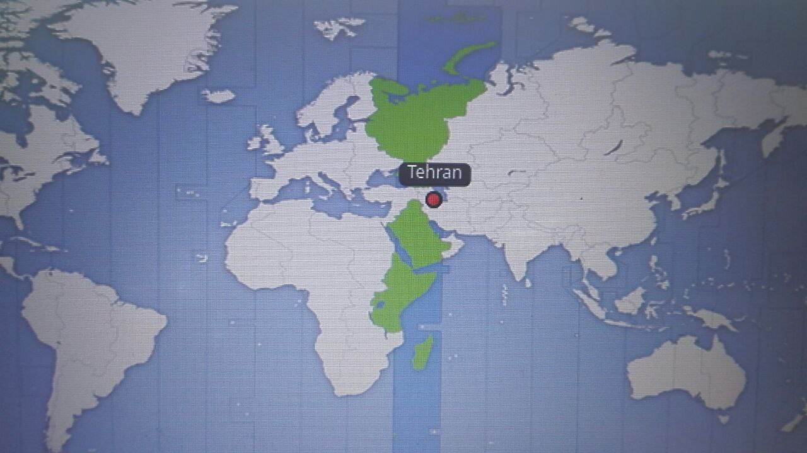
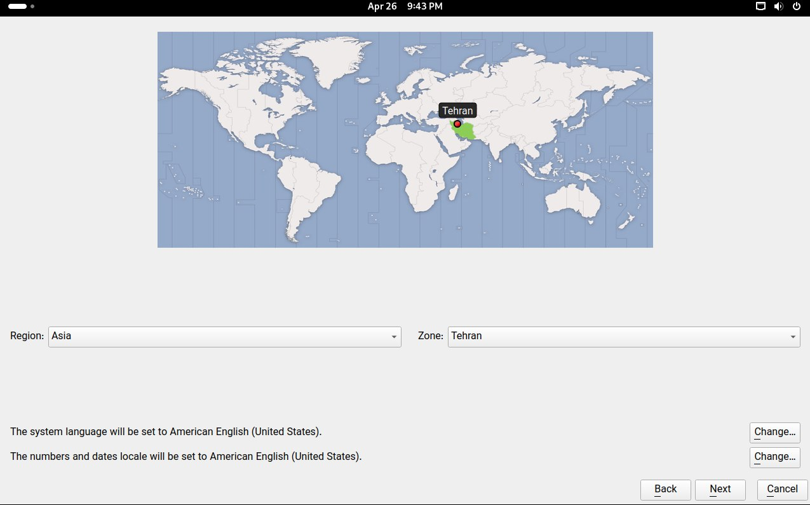

+++
title = "کمی درمورد پارچ"
description = "در پاسخ به برخی سوالات"
date=2024-05-06
category = "پارچ"
tags = ["پارچ"]

[extra]
author="سهراب بهدانی"
+++

توی این پست از بلاگم می‌خوام در این‌باره صحبت کنم که پروژه پارچ بعد از ایجاد شدنش چه مشکلاتی رو در باقی پروژه ها رفع کرده.

پروژه پارچ یک پروژه طولانی مدت هستش با هدف ساخت یک توزیع برای قشرهای مختلف که به راحتی قابل استفاده باشه و همینطور مشکلات باقی توزیع هارو نداشته باشه.

وحالا به مشکلاتی که درکنار پروژه پارچ رفع شدن می‌پردازیم.

# کالامارس (نصب کننده‌ای همه جانبه)

کالامارس نصب کننده ای هستش که در اکثر توزیع‌های لینوکسی به‌کار رفته، یک پروژه از بنیاد کی‌دی‌ای با هدف ایجاد یک نصب کننده استاندارد.
پروژه کالامارس از ابتدا یک‌سری مشکلاتی داشته که در ادامه بهشون می‌پردازم.

## مشکل منطقه زمانی

در کالامارس زمانی که شما می‌خواستید تهران رو به عنوان منطقه‌زمانی خودتون انتخاب کنید، همه جای نقشه سبز می‌شد جز تهران!

و بعد از یک سری پیگیری‌ها داخل گروه کالامارس در نسخه جدید کالامارس این مشکل به صورت کلی برطرف شد 😁

## مشکل عدم وجود کیبورد لاتین بعد از نصب به زبان فارسی

این یکی مشکل یکمی پیچیده‌تر بود نسبت به بقیه.
در اکثر توزیع‌های لینوکسی مثل اوبونتو، فدورا و بقیه که از کالامارس استفاده نمی‌کنن، زمانی که شما توزیع رو به زبان فارسی نصب کنید و یا کیبورد فارسی رو انتخاب کنید، بعد از نصب یک کیبورد لاتین روهم برای شما برای سهولت در ورود به سیستم قرار می‌دن.

این مشکل داخل کالامارس از ابتدای ایجادش وجود داشته و کسی به فکر حل کردنش نیفتاده بوده تا الان که خیلی هم عجیبه.

این مشکل داخل [گیتهاب کالامارس](https://github.com/calamares/calamares/issues/2307) اعلام شد و بعد از کمی گفتگو با بقیه مشارکت کننده ها یک فورک از کالامارس برای رفع این مشکل ایجاد شد.

این مشکل در درخواست ادغامی که از طرف ما ارسال شد به صورت کلی رفع شد و خوبی که داشت این هستش که این مشکل به صورت آپ‌استریم در همه توزیع هایی که از کالامارس استفاده می‌کنن حل میشه.

[درخواست ادغام](https://github.com/calamares/calamares/pull/2324)

# کی‌دی‌ای

## ترجمه

پروژه کی‌دی‌ای یک پروژه بسیار بزرگ در دنیای گنو/لینوکس هستش. متاسفانه این پروژه در سال‌های اخیر ترجمه فارسی خودش رو از دست داده و در کنار همین یک سری مشکلاتی روهم برای زبان فارسی ایجاد کرده.

یکی از کارهایی که از طرف خودم صورت گرفت، برسی و درخواست از تیم کی‌دی‌ای برای دریافت دسترسی ترجمه بود که این درخواست باهاش موافقت شد و دسکتاپ کی‌دی‌ای الان تحت ترجمه قرار داره.

## متن دوسویه

برنامه های پروژه کی‌دی‌ای اکثرشون از متن دوسویه پشتیبانی نمی‌کنن، این مشکل در برنامه‌هایی که با کریگامی نوشته شدن مثل توکادون (کلاینت فدیورس) و نئوچت (کلاینت ماتریکس) از بقیه مشهود تره. یک سری درخواست رفع مشکل داخل باگ‌زیلا کی‌دی‌ای ثبت شد که بعد از عرضه پلاسما ۶ هم مشکلات متن دوسویه حل شد و هم اینکه به متن دوسویه داخل پروژه های دیگه هم اهمیت داده شد.

# لینوکس موبایل

## کیبورد فاش

یکی از مشکلاتی که داخل پارچ موبایل همراه فاش باهاش برخورد داشتم، کیبورد فارسی اون بود که برخی از حروف رو نداشت و شدیداً برای استفاده سخت و بدردنخور بود.

با کمک دانیال بهزادی عزیز، [فورکی](https://github.com/Parchlinux-Arm/squeekboard/) از این کیبورد داخل گیت‌هاب پارچ‌آرم ایجاد شد و بعد از تغییراتی ریز کد هارو برای دانیال عزیز ارسال کردم تا بعد از بازبینی و تغییرات نهایی داخل پروژه گنوم ادغام بشه.

این‌ها یک‌سری از مشکلاتی بودند که در کنار پروژه پارچ رفع و یا درحال رفع شدن هستن.

پ.ن: هنوز نتونستم سیستم درست حسابی رو برای کامنت‌دهی راه بندازم، دارم تلاشم رو می‌کنم ولی 🤕
